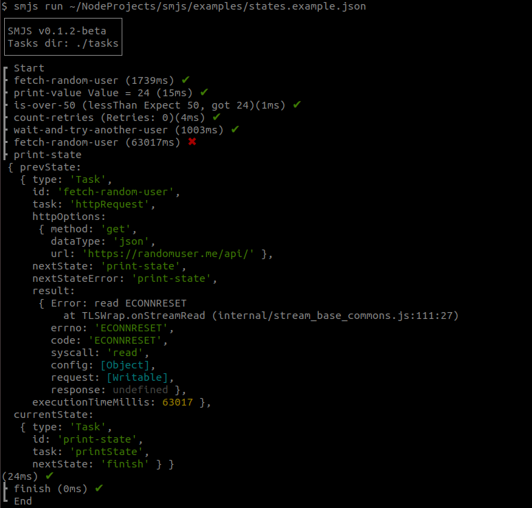
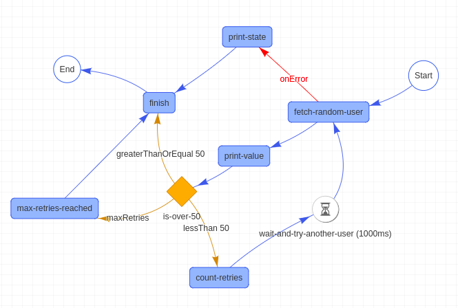

# smjs


## Summary
1. Installation
2. States Example
3. Running
 - CLI Command
 - Class usage
4. Viewing the states flow
5. State definition
6. Task definition
7. Choices
8. Parameters
9. Built-In Tasks
 - countState
 - execFile
 - httpRequest
 - printState
 - printValue
 - wait 

## Installation
```
npm install @danilolima/smjs -g
```

## States Example (states.json)
```json
{
    "name": "states-example",
    "initialState": "fetch-random-user",
    "parameters": {
        "NAME": "Danilo"
    },
    "tasksDir": "./tasks",
    "verbose": true,
    "states": [
        {
            "type": "Task",
            "id": "fetch-random-user",
            "task": "httpRequest",
            "httpOptions": {
                "method": "get",
                "dataType": "json",
                "url": "https://randomuser.me/api/"
            },
            "nextState": "print-value",
            "nextStateError": "print-state"
        },
        {
            "type": "Task",
            "id": "print-value",
            "task": "printValue",
            "variablePath": "$.result.data.results[0].dob.age",
            "nextState": "is-over-50"
        },
        {
            "type": "Task",
            "id": "count-retries",
            "task": "countState",
            "nextState": "wait-and-try-another-user"
        },
        {
            "type": "Choice",
            "id": "is-over-50",
            "choices": [
                {
                    "variablePath": "$.countRetries",
                    "condition": "equals",
                    "expect": 10,
                    "nextState": "max-retries-reached",
                    "label": "maxRetries"
                },
                {
                    "variablePath": "$.result.data.results[0].dob.age",
                    "condition": "lessThan",
                    "expect": 50,
                    "nextState": "count-retries"
                },
                {
                    "variablePath": "$.result.data.results[0].dob.age",
                    "condition": "greaterThanOrEqual",
                    "expect": 50,
                    "nextState": "finish"
                }
            ]
        },
        {
            "type": "Wait",
            "id": "wait-and-try-another-user",
            "nextState": "fetch-random-user",
            "timeout": 1000
        },
        {
            "type": "Task",
            "id": "max-retries-reached",
            "nextState": "finish"
        },
        {
            "type": "Task",
            "id": "print-state",
            "task": "printState",
            "nextState": "finish"
        },
        {
            "type": "Task",
            "id": "finish",
            "end": true
        }
    ]
}
```

### Running
```
smjs run states.json
```


### Visualizing

```
smjs view states.json
```


## Built-In Tasks

### wait
| Field | Description |
|-------|-------------|
|timeout|Set timeout value |
